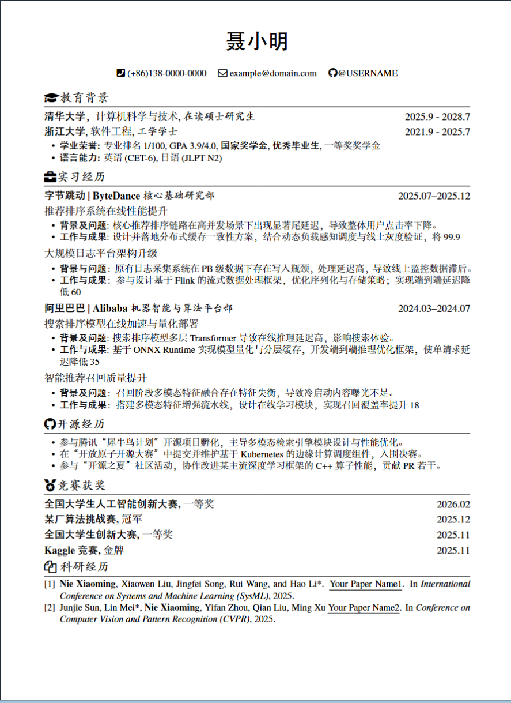

## 🚀 快速开始

**1) 在线编译（推荐）**
- 把本项目打包成 ZIP（或直接上传整个文件夹）
- 在 **Overleaf / ShareLaTeX** 中上传
- 选择 **XeLaTeX** 编译即可

**2) 本地编译**
```bash
xelatex main.tex
```

### 🔧 字体方案

- 如果 **系统已安装 Adobe 中文字体**，请启用：`zh_CN-Adobefonts_internal`
- 如果 **没有 Adobe 字体**，请启用：`zh_CN-Adobefonts_external`（模板内含宋体、黑体、楷书、仿宋）

### 📌 常用宏

- `\name{}`：姓名
- `\contactInfo{邮箱}{手机号}{个人主页}`：联系方式
- `\datedsubsection{标题}{时间}`：带时间的条目（右对齐）
- `\section{}`：章节（如教育、实习）
- `\subsection{}`：小标题（无时间）
- `\itemize`：无序列表
- `\enumerate`：有序列表


### 🎨 FontAwesome （可选）

1. 访问 [Font Awesome 图标库](https://fontawesome.com/icons) 或查找[fontawesome6.pdf](./fontawesome6.pdf)
2. 在简历里直接写：`\faGithub @你的账号`。

### 预览


### 📃 License

[The MIT License (MIT)](http://opensource.org/licenses/MIT)

Copyrighted fonts are not subjected to this License.